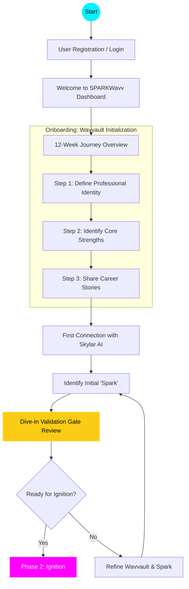

# Dive-In Phase UX Diagram

The **Dive-In** phase is the foundational stage of the SPARKWavv 12-week journey (Weeks 1-2). It focuses on account setup, initializing the user's digital career repository (Wavvault), and establishing the first connection with Skylar, the AI career architect.

## UX Flow Diagram

## Key Components of the Dive-In Phase

### 1. Wavvault Initialization
Users provide the raw data that powers the AI synthesis. This includes their professional narrative, a list of strengths, and formative career stories.

### 2. Skylar Connection
The first interaction where Skylar analyzes the initial data to begin building the user's "Neural Synthesis".

### 3. The "Spark"
The core motivation or unique value proposition that will be refined throughout the journey.

### 4. Validation Gate
A critical review point where the user must demonstrate commitment to the 12-week process and have a clearly identified initial "Spark" before progressing to the **Ignition** phase.
